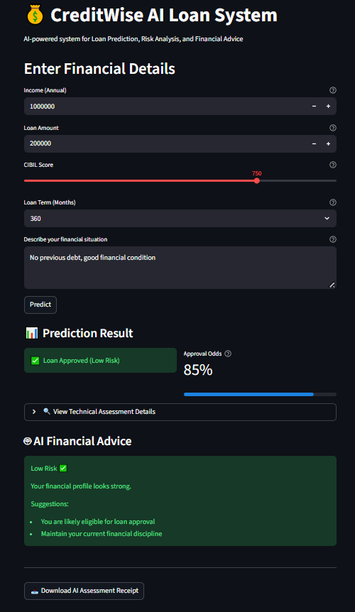
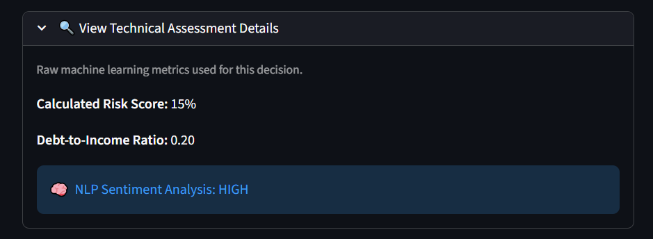
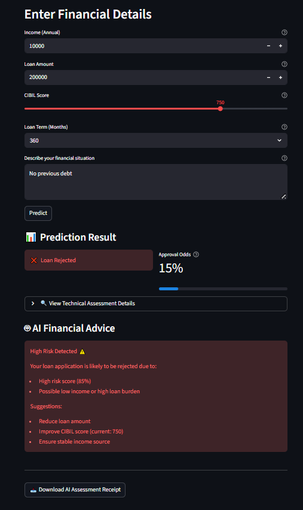

# 💰 CreditWise AI Loan System

An enterprise-grade, AI-powered financial application that predicts loan approvals, analyzes text sentiment, and generates actionable financial advice using Machine Learning and NLP. Built with Python and Streamlit.

## 🖥️ Application Previews

### 🟢 Prediction Result (Approved)


### 🔍 Technical Assessment Details


### 🔴 Prediction Result (Rejected)


---

## 🏗️ Project Architecture

- **ML Model** → Loan prediction  
- **NLP Module** → Text risk analysis  
- **LLM Module** → Financial advice generation  
- **Streamlit** → User Interface

---

## 🚀 Features

* **Machine Learning Risk Assessment:** Evaluates financial profiles using a Scikit-Learn model to generate precise "Approval Odds" and risk scores.
* **Dynamic Loan Logic:** Calculates debt-to-income ratios and adjusts risk profiles based on user-selected loan terms (12 to 360 months).
* **NLP Sentiment Analysis:** Analyzes free-text user financial descriptions to detect hidden risk factors and financial stability.
* **LLM Financial Advice:** Generates personalized, color-coded financial recommendations based on the user's specific risk bracket.
* **Enterprise UI/UX:** Features technical metric expanders, visual progress bars, accessibility tooltips, and input validation guardrails.
* **Exportable Receipts:** Users can download a `.txt` receipt of their AI financial assessment for their records.

---

## 📊 How It Works

1. User inputs financial details (income, loan amount, CIBIL score, loan term).
2. ML model predicts loan approval probability.
3. Risk score and Debt-to-Income ratio are calculated.
4. NLP analyzes user text input for hidden sentiments.
5. AI generates personalized, exportable financial advice.

---

## 📌 Example Scenario

**Input:**
- Income: 1,000,000  
- Loan: 200,000  
- CIBIL: 750
- Loan Term: 360 Months

**Output:**
- Loan Approved ✅  
- Approval Odds: 85%  
- Text Risk: LOW

---

## 🧠 Tech Stack

* **Language:** Python
* **Frontend:** Streamlit
* **Machine Learning:** Scikit-Learn, Pandas, NumPy (Random Forest / Classification)
* **Natural Language Processing:** Custom NLP Module (TF-IDF + Logistic Regression)
* **Generative AI:** Custom LLM Advisor Module

---

## 📚 Key Learnings

- Built an end-to-end ML system.
- Combined Machine Learning with strict rule-based domain logic.
- Designed an interactive, enterprise-ready UI using Streamlit.
- Improved model reliability by handling real-world financial edge cases effectively.

---

## ▶️ How to Run

1. Clone the repository:

```bash
git clone https://github.com/Sanidhya069/CreditWise-AI-Loan-System.git
cd CreditWise-AI-Loan-System
```

2. Install dependencies:

```bash
pip install -r requirements.txt
```

3. Run the Streamlit application:

```bash
streamlit run app.py
```

## 📌 Future Improvements

- Improve model with a larger dataset.
- Add real-time credit APIs.
- Deploy on cloud platforms.

---

## ⚙️ Under the Hood (Decision Logic)

The system doesn't just blindly trust the ML model; it includes hardcoded financial guardrails for safety:

- **Auto-Approval:** CIBIL scores >= 750 with a Debt-to-Income ratio <= 0.5 bypass standard checks for immediate approval (Low Risk).

- **Auto-Rejection:** CIBIL scores < 500 or extreme Debt-to-Income ratios (> 5.0) trigger immediate rejection and maximum risk scoring.

---

## 👨‍💻 Author

Sanidhya Shrivastava

---

## ⚖️ Disclaimer

*CreditWise AI is an educational demonstration and portfolio project. The financial advice and risk scores provided by this AI model do not constitute official financial, legal, or professional advice.*